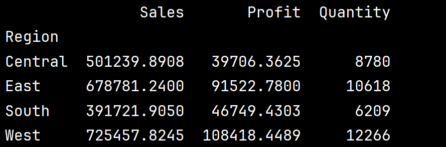
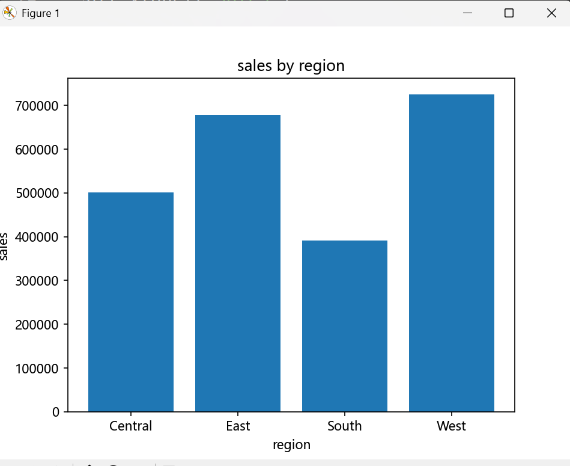
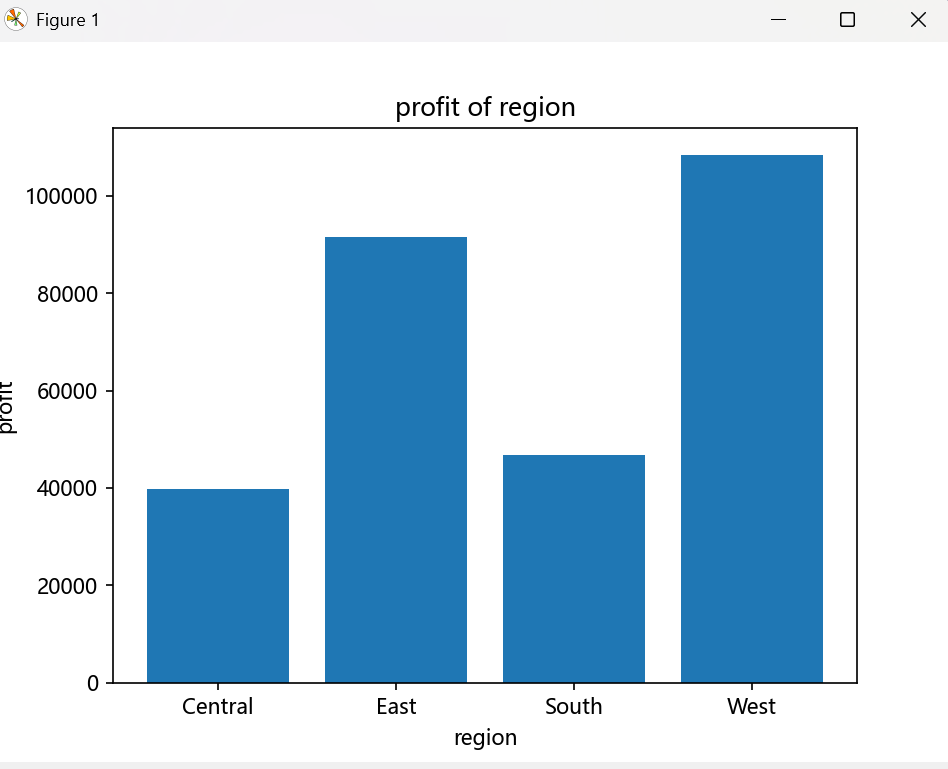
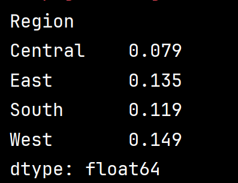
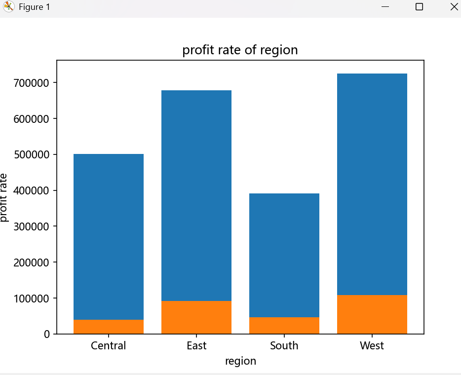
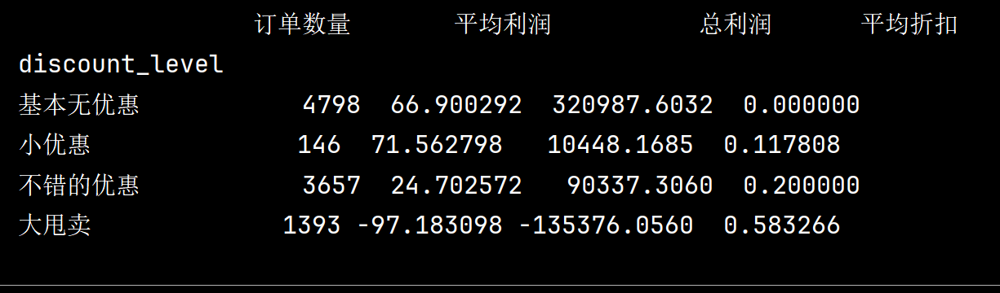
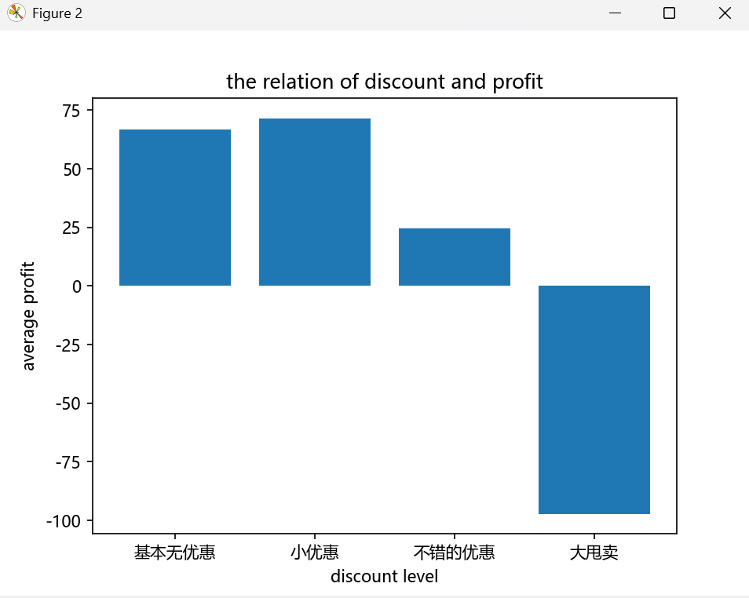

# Superstore 销售与利润分析

## 1. 项目概述

### 1.1 项目背景

基于 Superstore 零售订单数据，从销售额、利润、客户、地区、产品及折扣等维度进行分析，识别影响销售表现和盈利能力的关键因素，并通过数据可视化展示主要发现。

### 1.2 项目目标

- 分析不同时间、地区、客户类型及产品的销售与利润表现
- 识别高价值客户及高贡献业务区域
- 分析折扣水平与企业利润之间的关系
- 通过 SQL 与 Python 构建较完整的数据分析流程

---

## 2. 数据集介绍

### 2.1 数据规模

- 订单明细：9,994 条
- 主要分析字段：Order Date、Customer、Product、Sales、Quantity、Discount、Profit 等
- 数据来源：Superstore 数据集

### 2.2 数据检查与预处理(详见第一个py文件)

- 检查数据完整性及字段类型(总体概况)
- 对原始数据进行基础清洗(更改不合适的数据类型)
- 将清洗后的数据保存为新csv文件,导入 MySQL
- 本次数据无缺失值,所以少了很多工作量
---

## 3. 分析工具与技术

- **Python**：Pandas、Matplotlib
- **SQL**：MySQL
- **数据处理**：数据清洗、分组聚合、字段分类
- **数据分析**：描述性统计、业务指标分析
- **数据可视化**：柱状图

---

## 4. MySQL 业务分析

### 4.1 查看总体经营情况
-  总销售额    sum(Sales)
-  总利润      sum(Profit)
-  总销售量    sum(Quantity)

### 4.2 地区分析
-  查询每个地区的总销售额与总利润(groupby(Region))

### 4.3 子类别 (Sub-Category)
-  找出利润最大的;销量最高的......

### 4.4 where用法
-  先筛选，再分组 ,位置＞group by ,紧挨着from 表名

### 4.5 case when用法
-  CASE
-    WHEN 条件 THEN 结果
-    ELSE 其他结果
-  END (as "新字段名")

### 4.6 having用法
-  先分组后筛选 , 一般放在最后

### 4.7 时间维度分析

- 分析 2015～2018 年销售额与利润变化
- 分析不同年月的销售表现
- 识别销售额较高的关键时间段

### 4.8 客户分析

- 分析客户总销售额与总利润
- 识别高价值客户
- 比较不同客户类型的销售与盈利表现

### 4.9 产品分析

- 分析不同产品的销售额与利润
- 识别高销售额产品
- 关注高销售额但低利润的产品

### 4.10 折扣分析

- 按折扣区间划分订单
- 比较不同折扣水平下的销售额与利润
- 分析折扣与盈利能力之间的关系

### 4.11 聚合函数用法
-  比较简单 sum(字段),avg(字段)等等

### 4.12 多表关联分析(join连接)

- 建立客户表与订单表
- 通过 Customer ID 进行 INNER JOIN
- 综合分析客户属性与订单表现
- from 表1 表1昵称 join 表2 表2昵称 on 表1昵称.相关联字段名 = 表2昵称.相关联字段名

---

## 5. Python 数据分析

### 5.1 描述性统计

对 Sales、Profit、Quantity、Discount 等变量进行描述性统计，了解数据的集中趋势及离散程度。

### 5.2 四个地区销售额与利润分析

比较不同地区的：

- 总销售额
- 总利润
- 总销量
- 利润率

通过分别绘制销售额与利润的柱状图
进一步比较销售规模与盈利效率之间的差异。
- 销售额与地区的联系:

- 利润与地区的联系:

### 5.3 比较四个地区的利润率
- 利润率 = 总利润 ÷ 总销售额

- 柱状图为:
!

### 5.3 折扣与利润分析

将 Discount 划分为不同区间，分析：

- 订单数量
- 平均利润
- 总利润
- 平均折扣

重点观察高折扣订单的盈利表现。
- 柱状图为:

---

## 7. 核心发现

### 7.1 地区表现

West 不仅具有较强的销售规模，同时盈利效率也较高；Central 虽然有一定销售规模，但利润率明显偏低，说明其盈利效率存在进一步改善空间。

### 7.2 折扣与利润

分析结果显示，折扣水平与平均利润表现存在明显差异。低折扣区间的平均利润整体较高，而随着折扣水平进一步提高，平均利润明显下降。

当折扣达到较高水平时，利润受到明显挤压，30% 以上折扣区间的平均利润已经转为负数，说明过高的折扣可能显著削弱产品盈利能力。

需要注意的是，该分析反映的是折扣与利润之间的相关关系，并不能单独证明折扣提高一定会导致利润下降。

### 7.3 客户与产品

客户分析表明，不同客户类型在销售规模和盈利贡献方面存在差异。通过按客户进行销售额和利润汇总，可以识别高贡献客户，并进一步了解不同客户类型的经营表现。

产品分析显示，销售额较高的产品并不一定具有同样高的利润贡献。部分产品虽然拥有较高的销售额，但利润表现相对较弱，说明仅以销售额评价产品表现可能存在局限。

因此，在客户管理和产品管理中，应同时关注销售规模与利润贡献，而不仅仅关注销售额。

---

## 8. 业务建议

基于分析结果，从折扣策略、客户管理、产品管理及区域经营等方面提出业务优化建议。

---

## 9. 项目总结

通过本项目，完成了从数据清洗、MySQL 数据查询，到 Python 数据分析与可视化的完整流程。

项目重点提升了以下能力：

- SQL 业务查询与多表分析能力
- Pandas 数据处理与分组分析能力
- Matplotlib 数据可视化能力
- 从数据结果提炼业务结论的能力